<h1 align="center">Portföyüm</h1>

Bu proje, kullanıcıların kendi adına oluşturabileceği bir portföy ve CV indirme projesidir. Vitrin kısmında görüntülenmek üzere veriler veritabanından dinamik olarak çekilmektedir. Proje, temel CRUD (Create, Read, Update, Delete) işlemleri ile yetenek yönetimini sağlamaktadır. Admin panelinde projenin her kısmı düzenlenebilir. 

İletişim kısmında, kaydı olmayan misafirler e-posta ile mesaj gönderebilir ve bu mesajlar admin panelinde yanıtlanabilir. Kullanıcılar, profil kısmında profil fotoğraflarını ve şifrelerini güncelleyebilirler.

<h2>Kullanılan Teknolojiler</h2>

### Framework
- **Entity Framework 8.0**

### Veritabanı
- **MSSQL**

### Web Teknolojileri
- **HTML / CSS**
- **JavaScript**

### Kimlik Yönetimi
- **Identity**

<h2>Kullanılan Tasarım Desenleri</h2>
<ul>
    <li><strong>Repository Pattern</strong></li>
</ul>

<h2>Proje Görselleri</h2>

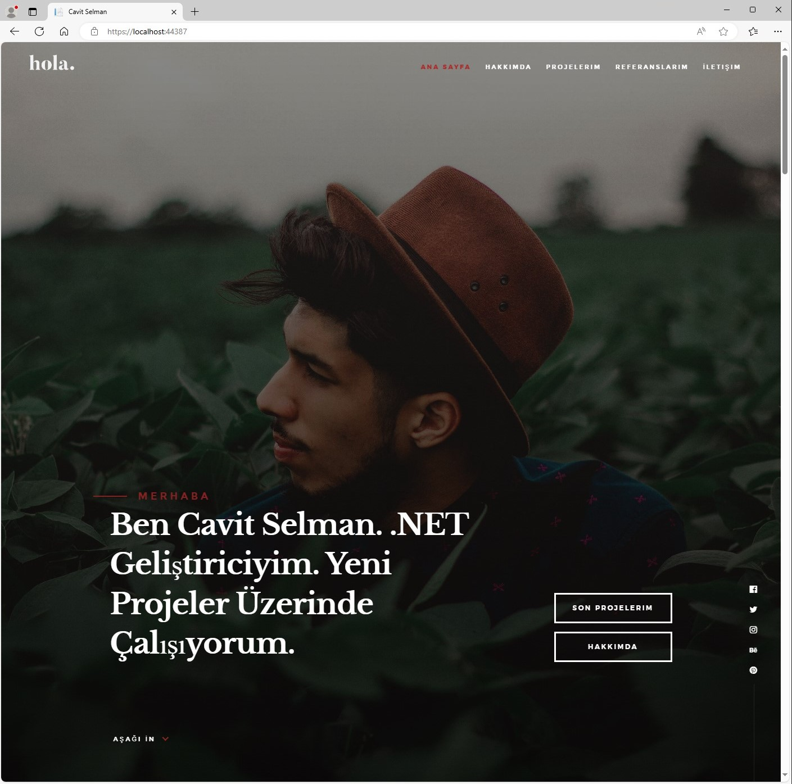
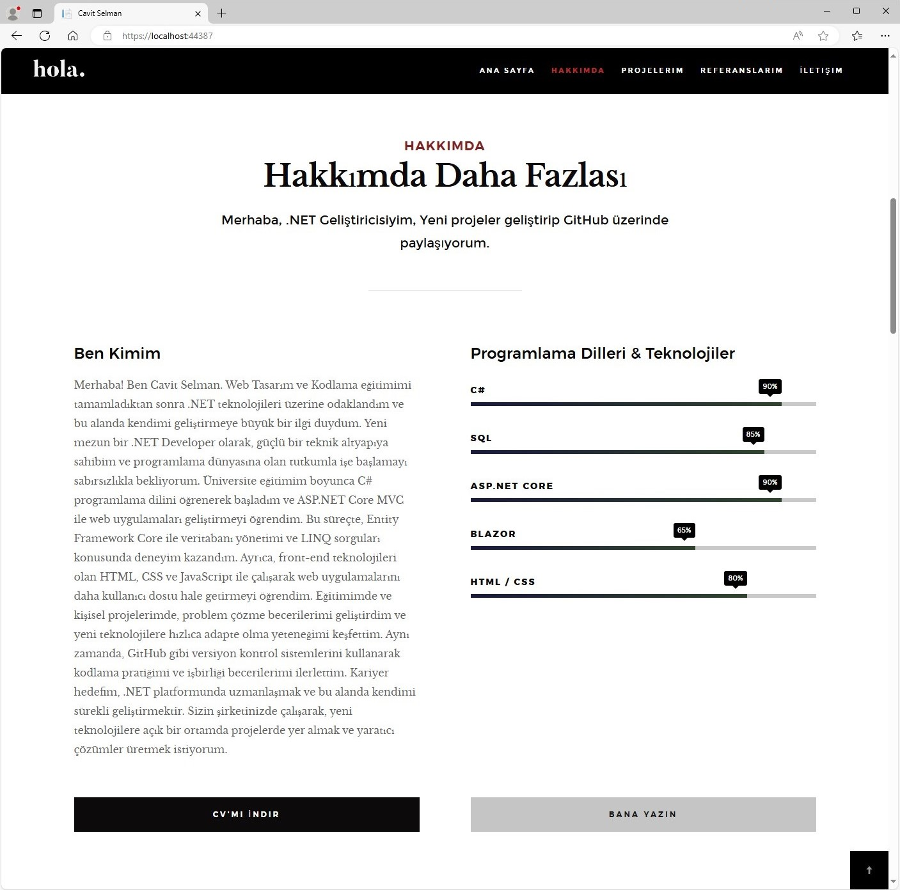
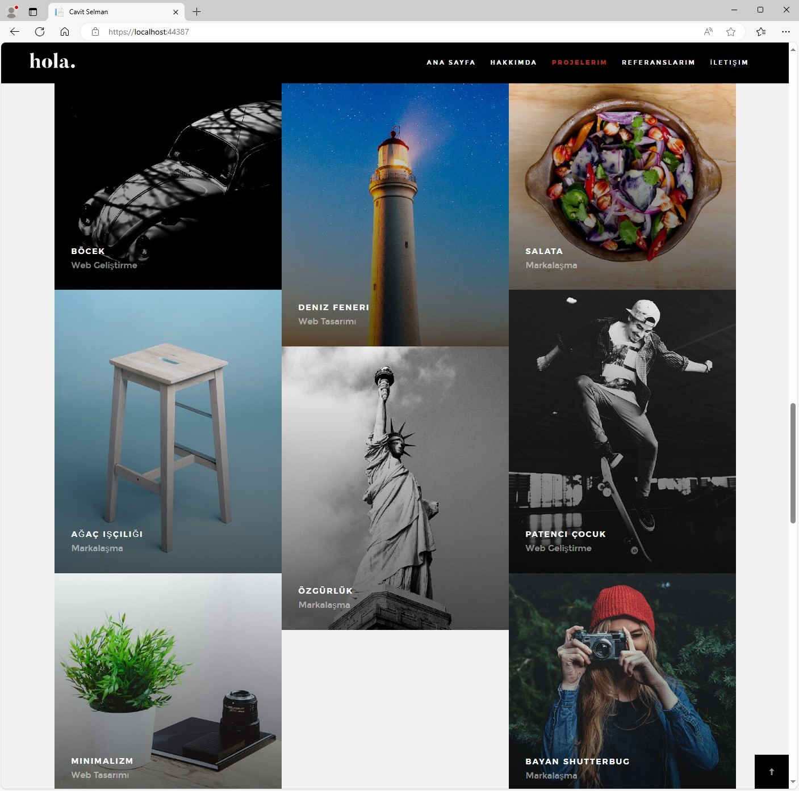
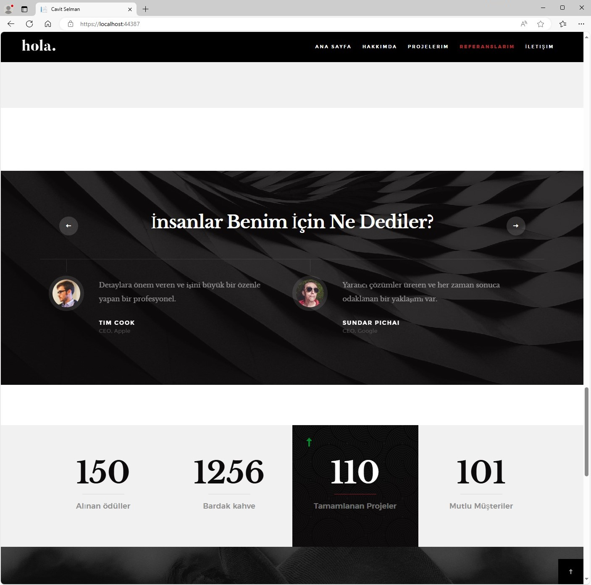
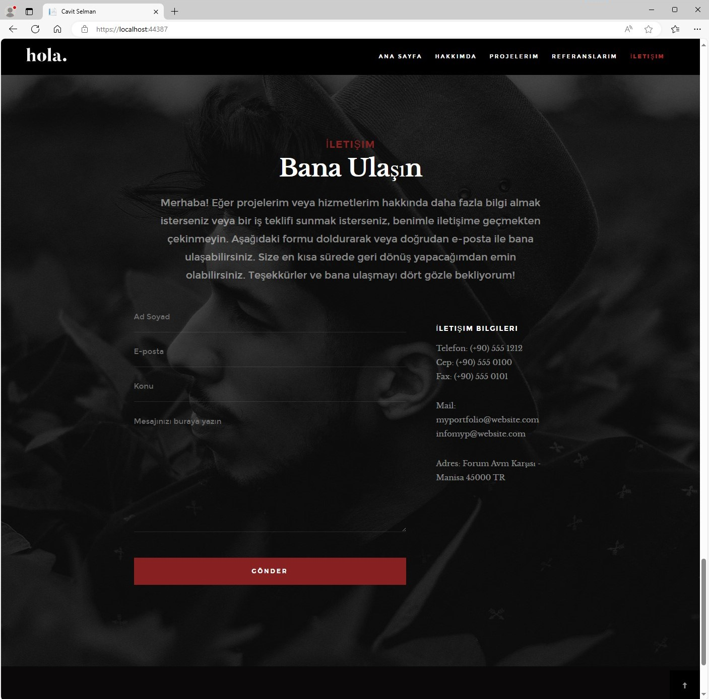
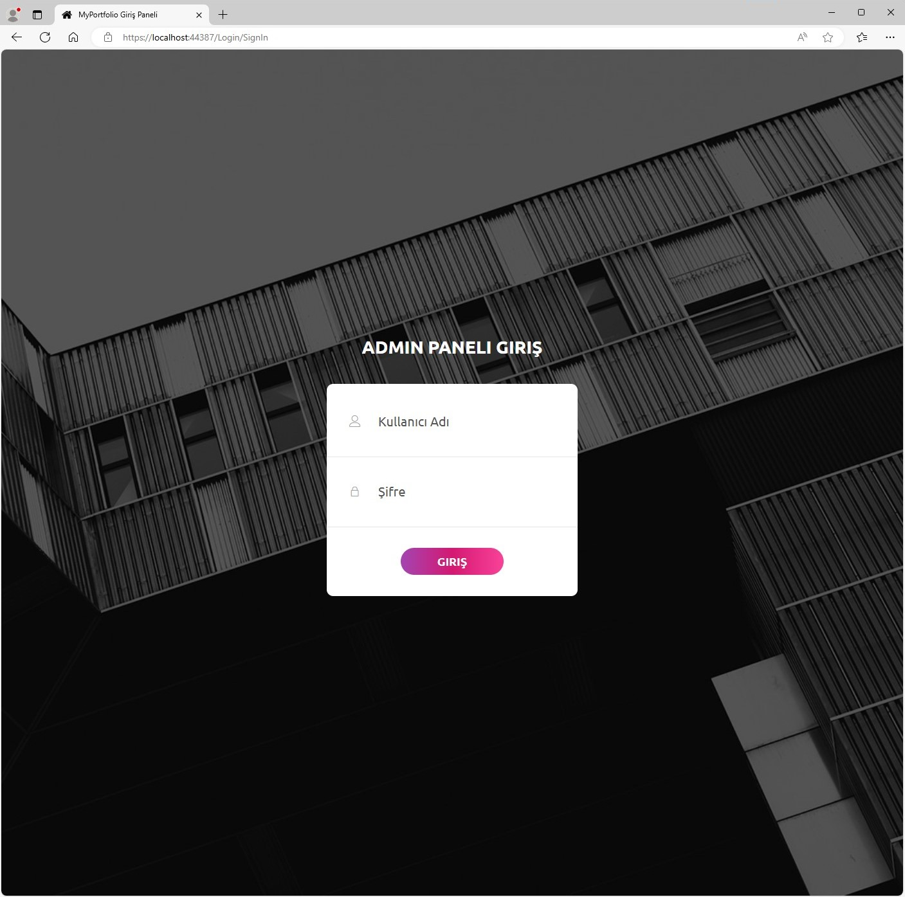
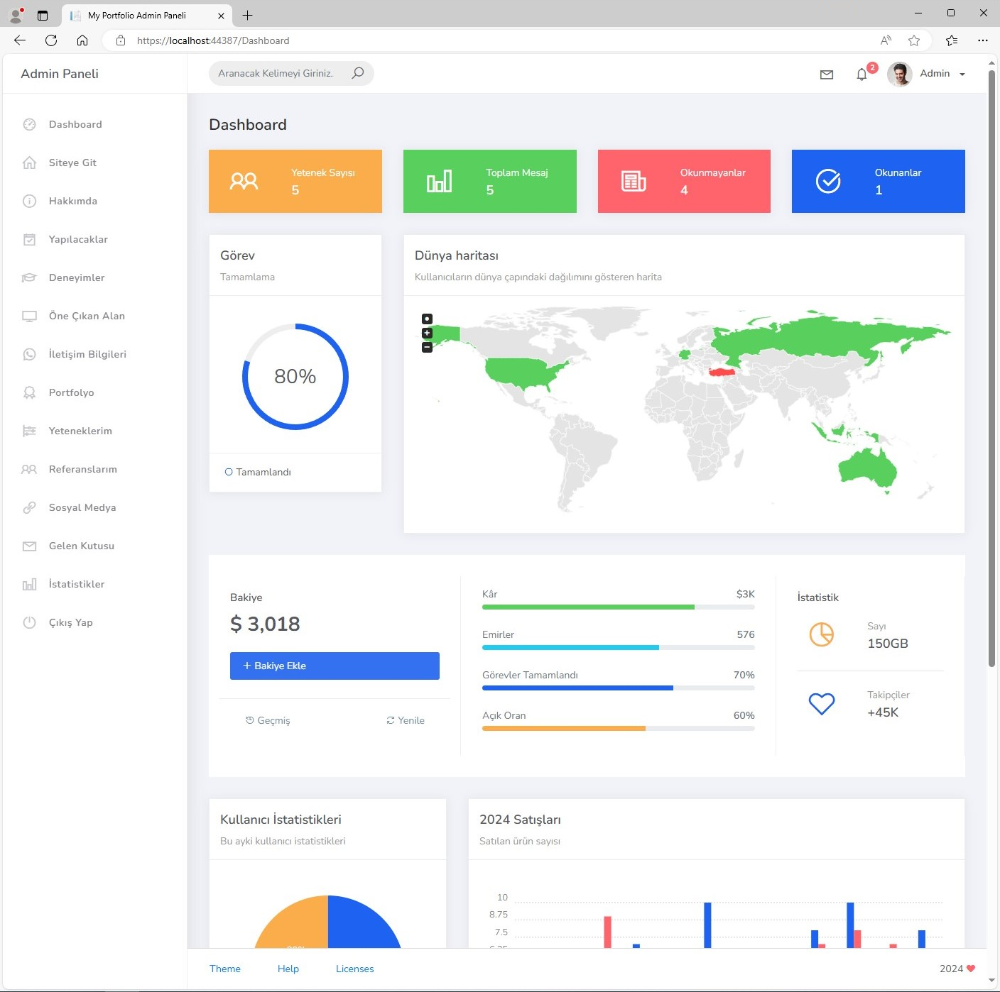
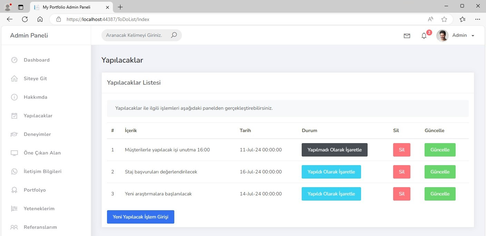
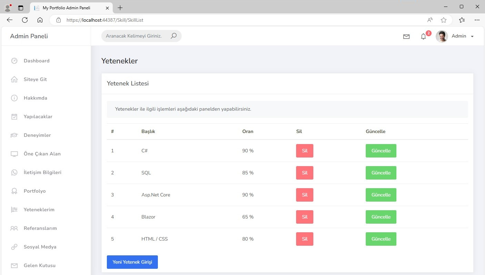
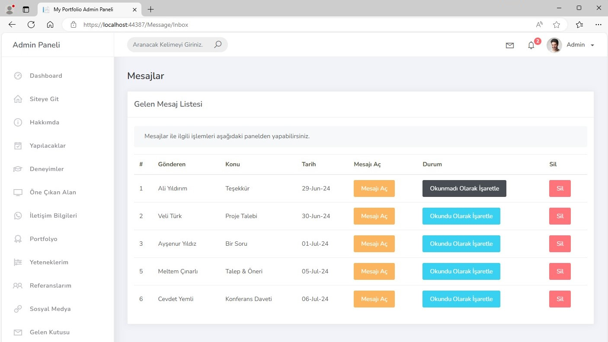
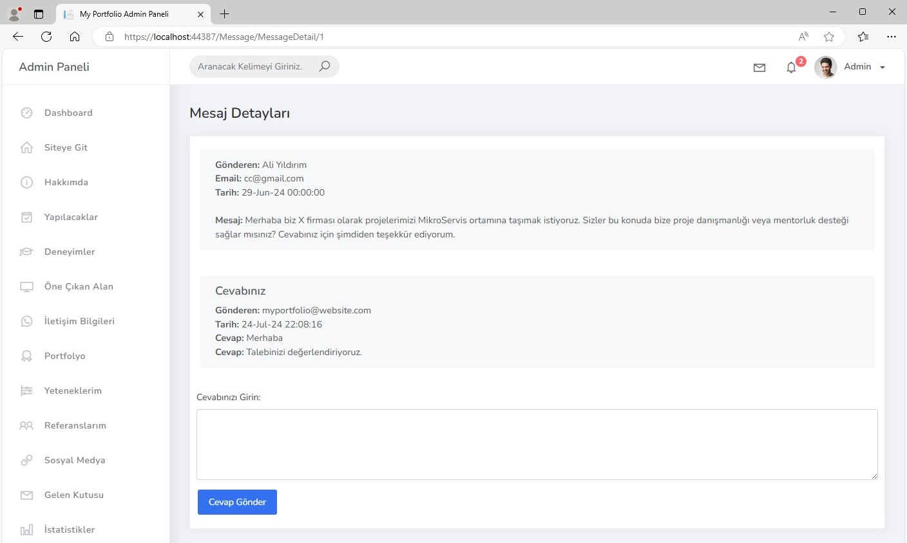
